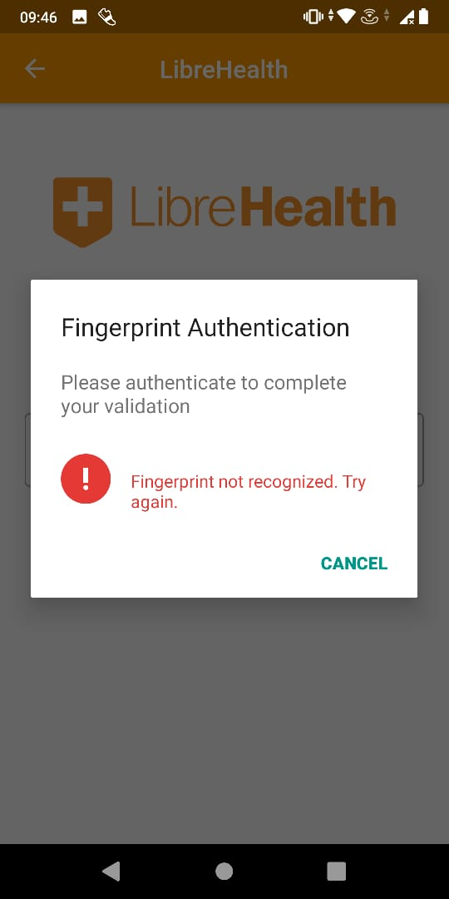

# LibreHealth - GSOC 2020

Android application for healthcare workers in Kenya to capture birth information and elements of essential newborn care, such as immunization using flutter, firebase and SQLite.
The project is for LibreHealth organization in GSOC 2020.

## Getting Started

=> Open your Git Bash command window and in the root directory type the following commands:

    1) git init -initializes the git repository from the GitHub. 
    2) git clone -Clone the repository to your local machine
=> Open your Android IDE:

    1) Open the file at the root directory
    2) Code your modifications in the project.
 

=> For help getting started with Flutter, view our [online documentation](https://flutter.dev/docs), which offers tutorials, samples, guidance on mobile development, and a full API reference.
 

P.S: You already have all the basic libraries and extensions of flutter on your IDE. 

## ScreenShots of the Flutter Application

    

    

    

    
